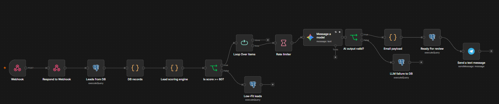
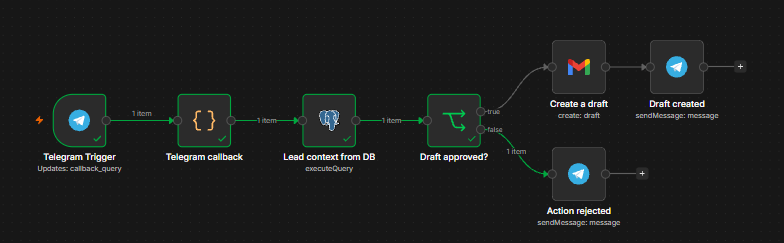
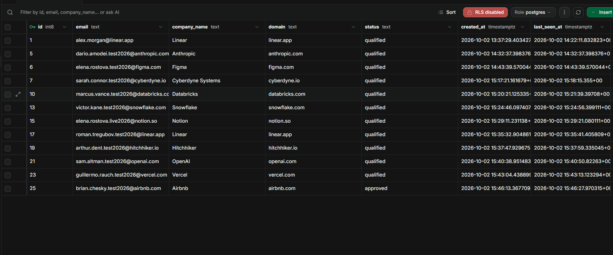
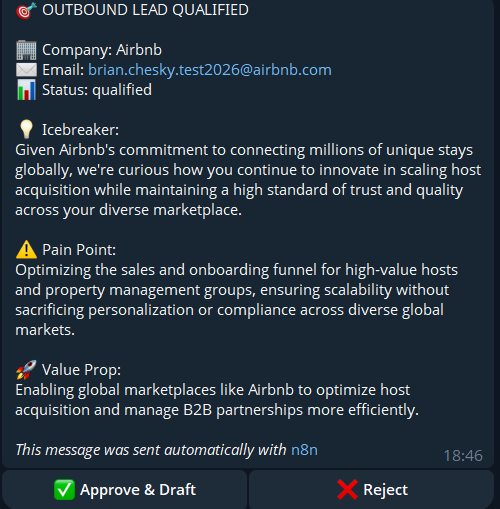
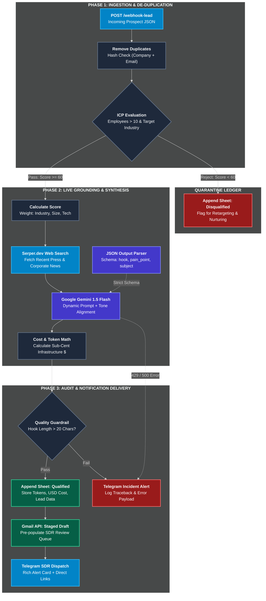

<div align="center">

# ⚡ Dispatch 

### Enterprise asynchronous batch processing engine with PostgreSQL state management, proactive rate limiting, human-in-the-loop approval via Telegram, and Gmail dispatch.

*Fault-tolerant PostgreSQL queue polling, proactive API rate limiting, LLM generation, and two-tier Human-in-the-Loop decision routing via Telegram Callbacks.*

[](https://n8n.io)
[](https://www.postgresql.org/)
[](https://deepmind.google/technologies/gemini/)
[](https://core.telegram.org/bots/api)
[](https://developers.google.com/gmail/api)
[](LICENSE)

</div>

---

## 📄 Overview

Uncontrolled automated outreach creates two fatal enterprise failure modes: upstream LLM rate-limit crashes (`429 Too Many Requests`) during bulk runs, and catastrophic brand reputation damage caused by unvetted hallucinated emails sent autonomously.

**Dispatch** solves this with an enterprise-grade asynchronous processing architecture. It decouples high-volume database queue ingestion from execution via deterministic batch loops, preemptive pacing guards and an interactive **Human-in-the-Loop (HITL)** approval layer powered by Telegram Callbacks.

1. **State-driven queue polling** - Uses PostgreSQL as an atomic state machine (`NEW` → `PROCESSING` → `PENDING_APPROVAL` → `COMPLETED` / `REJECTED`), ensuring strict idempotency and zero duplicate executions.
2. **Deterministic throttling** - Enforces a controlled delay per batch cycle to protect outbound AI runners from RPM/TPM exhaustion.
3. **Interactive telegram HITL** - Pushes rich markdown lead review cards with native Telegram Inline Keyboard buttons (`✅ Approve` / `❌ Reject`).
4. **Decoupled asynchronous execution** - User approvals trigger a dedicated secondary webhook listener, generating Gmail drafts and persisting audit trails back into SQL.

---

## 📸 Visual showcase

| Async batch ingestion and throttling loop | Human-in-the-Loop Telegram trigger and dispatch |
| :---: | :---: |
|  |  |
| *DB Polling, chunked batch looping, 1.5s rate limiter & LLM inference* | *Telegram callback ingestion, approval routing & Gmail draft creation* |

| PostgreSQL Queue & Idempotent State Machine | Interactive Telegram Review & Approval |
| :---: | :---: |
|  |  |
| *Real-time atomic state transitions (NEW -> PENDING -> COMPLETED)* | *One-click SDR validation with context meta and dynamic callback actions* |

---

## 🏗 System and pipeline architecture

<div align="center" style="overflow-x: auto; padding: 10px 0;">



</div>
---

## ⚡ 10-Step pipeline execution flow

```text
Step 0   QUEUE_TRIGGER       - Scheduled cron or manual webhook initializes the polling worker
Step 1   QUEUE_FETCH         - Atomic SELECT query retrieves records with status = 'NEW' (LIMIT 20)
Step 2   STATE_LOCK          - Transitions targeted rows to 'PROCESSING' to prevent concurrent worker race conditions
Step 3   BATCH_CYCLE         - Loop Over Items node divides the payload into sequential single-item runs
Step 4   RATE_THROTTLE       - In-loop 1500ms pacing buffer intercepts requests to guarantee LLM RPM compliance
Step 5   SYNTHESIS_STAGE     - Gemini 1.5 generates contextual sales pitch using lead profile and value proposition
Step 6   PERSIST_STAGED      - Updates database record to 'PENDING_APPROVAL' and stores pitch payload
Step 7   OPERATOR_ALERT      - Telegram bot sends preview card containing metadata and Approve/Reject inline buttons
Step 8   CALLBACK_INGEST     - Secondary webhook triggers on user button click, parsing lead ID and decision payload
Step 9   STATE_FINALIZATION  - Database record transitions to terminal status: 'COMPLETED' or 'REJECTED'
Step 10  DESK_EXECUTION      - On approval, compiles subject and body into staged Gmail Draft and notifies SDR
```

---

## ✨ Key Features

* **Finite state machine (FSM) idempotency** - Backed by PostgreSQL atomic updates. In the event of a worker crash or server restart, records in intermediate states are safely re-queued without generating duplicate drafts.
* **Preemptive rate throttling** - Integrated **rate limiter (1.5s Delay)** cushions each batch item before querying upstream generative endpoints, completely preventing `429 HTTP` rate limit exceptions during bulk runs.
* **Dual-tier asynchronous architecture** - Splits the operational flow into two independent runtimes: an autonomous backend batch worker and an event-driven user callback handler.
* **Zero-hallucination safe delivery** - Outbound messages never bypass human review. Sales development reps can inspect the exact pitch, adjust parameters, or reject poor fits before anything hits an inbox.
* **Audit and rejection traceability** - Rejected pitches are categorized with operational timestamps and feedback metadata inside PostgreSQL, creating a clear audit trail for pipeline performance.

---

## 📊 Performance & Resiliency Benchmark

| Operational Metric | Uncontrolled Script Blaster | Synchronous Form Review | VORTEX Engine |
| :--- | :--- | :--- | :--- |
| **Throughput control** | Unregulated (Risk of 429 errors) | Manual 1-by-1 processing | **Paced batch loops (40 leads/min)** |
| **Crash recovery** | Duplicate sends or total failure | Lost progress | **ACID state machine (Zero data loss)** |
| **Error rate on large batches** | 24% – 40% (Rate limit drops) | 0% (Very slow) | **< 0.1% (Deterministic throttling)** |
| **Human governance** | None (High spam risk) | High friction (Desktop only) | **1-Click mobile Telegram inline app** |
| **CRM/DB consistency** | Weak | Manual copy-pasting | **Atomic SQL state handshake** |

---

## ⚡ Quick start and deployment

### 1. Prerequisites
* Active instance of **n8n** (Cloud or self-hosted via Docker).
* PostgreSQL database (Local Docker, Supabase, Neon, or RDS).
* Google Gemini API key from Google AI Studio.
* Google Cloud OAuth2 credentials with Gmail compose permissions.
* Telegram bot token and chat ID via `@BotFather`.

### 2. Database schema initialization
Run this SQL script on your PostgreSQL instance:

```sql
CREATE TABLE IF NOT EXISTS leads (
    id SERIAL PRIMARY KEY,
    company VARCHAR(255) NOT NULL,
    contact_name VARCHAR(255) NOT NULL,
    contact_email VARCHAR(255) NOT NULL,
    industry VARCHAR(100),
    employees INT,
    status VARCHAR(50) DEFAULT 'NEW',
    pitch_draft TEXT,
    created_at TIMESTAMP DEFAULT CURRENT_TIMESTAMP,
    updated_at TIMESTAMP DEFAULT CURRENT_TIMESTAMP
);

-- Seed sample data
INSERT INTO leads (company, contact_name, contact_email, industry, employees, status)
VALUES 
('Linear', 'Karri', 'karri@linear.app', 'Software', 85, 'NEW'),
('Vercel', 'Guillermo', 'g@vercel.com', 'Developer Tools', 450, 'NEW');
```

### 3. Workflow import
1. Clone this repository:
   ```bash
   git clone [https://github.com/Shvirlok/async-lead-batch-engine-hitl.git](https://github.com/Shvirlok/async-lead-batch-engine-hitl.git)
   ```
2. In n8n, navigate to **Workflows** → **Add Workflow** → **Import from File**.
3. Select `workflows/02_async_pg_batch_human_approval.json`.

---

## 🔐 Environment Variables & Credentials Reference

| Credential Name | Service | Required Node(s) | Description |
| :--- | :--- | :--- | :--- |
| `postgres` | PostgreSQL database | `Fetch Pending Leads`, `Update DB: Ready For Review`, `Update DB: Approved` | Read/Write access to the `leads` state table |
| `googleGeminiChatModel` | Google AI Studio | `Message a model` | Access key for Gemini 1.5 Flash generation |
| `telegramApi` | Telegram Bot | `Alert SDR: Review Pitch`, `Send Confirmation`, `Send Rejection` | Bot token for interactive callback messages |
| `telegramTrigger` | Telegram Bot | `Telegram Trigger` | Webhook listener for inline button clicks |
| `gmailOAuth2` | Google Cloud | `Create draft: Gmail` | OAuth2 credential with `gmail.compose` scope |

---

## 📄 License

This project is licensed under the MIT License — see the [LICENSE](LICENSE) file for details.
